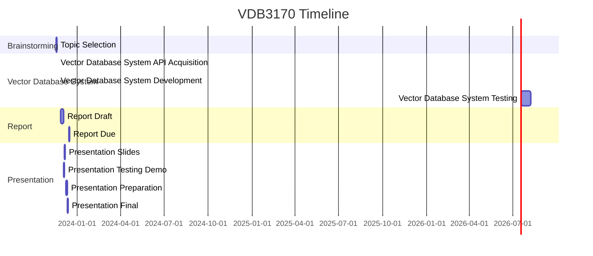

# vdb3170

2023 Fall CSC3170 Database System Final Group Project

## vdb3170 Overview

- 11/18 - 11/20: Brainstorming; All
- 11/21 - 11/30: System; All, Gao
- 11/27 - 12/4: Report; Wu, Ren, Kee, HT
- 12/5 - 12/8: PPT & Test case demo; Ren, Kee, HT
- 12/9 - 12/11: Prepare pre; HT, Ren, Kee
- 12/12: Final Pre; Kee, HT, Ren

## vdb3170 Timeline

## vdb3170 Teams

- Database System Teams: All, Gao
    <!-- - Database System Implementation:
    - Database System Testing: -->
- Report Teams: Wu, Ren, Kee, HT
    <!-- - Report Abstract:
    - Report Background:
    - Report Description:
    - Report Implementation:
    - Report Testing:
    - Report Conclusion:
    - Report Reference: -->
- Slides Teams: Ren, Kee, HT
    <!-- - Slides Abstract:
    - Slides Background:
    - Slides Implementation: -->
- Presentation Teams: HT, Ren, Kee
    <!-- - Slides Abstract:
    - Slides Background:
    - Slides Design: -->
