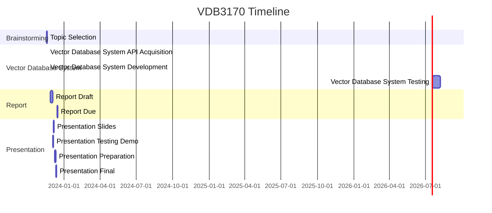

# vdb3170

2023 Fall CSC3170 Database System Final Group Project

We will use the [Tumblr GIF Description Dataset](http://raingo.github.io/TGIF-Release/), which contains over 100k animated GIFs and 120K sentences describing its visual content. Using this data with a *vector database* and *retriever* we are able to create an NLP-powered GIF search tool.

## vdb3170 Overview

- 11/18 - 11/20: Brainstorming; All
- 11/21 - 11/30: System; All, Gao
- 11/27 - 12/4: Report; Wu, Ren, Kee, HT
- 12/5 - 12/8: PPT & Test case demo; Ren, Kee, HT
- 12/9 - 12/11: Prepare pre; HT, Ren, Kee
- 12/12: Final Pre; Kee, HT, Ren

## vdb3170 Timeline



## vdb3170 Project Setup

```shell
# Pull the Qdrant Docker Image
docker pull qdrant/qdrant
# Create Virtual Environment
poetry install

# Start the Qdrant Server
docker run -p 6333:6333 \
    -v $(pwd)/qdrant_storage:/qdrant/storage \
    qdrant/qdrant

# Active the Virtual Python Environment
poetry shell
# Start the Streamlit Web Server
streamlit run vdb3170/app.py

```

## vdb3170 Project Layout

- The `vdb3170/gif-search.ipynb` demonstrates the data preparation, indexing, and querying steps needed to populate and query the index.
- The `vdb3170/app.py` is the Streamlit script powering the app itself.
- The `vdb3170/get_started.ipynb` use faked song examples to illustrate the elementary Qdrant Python Client API.
- The `data/tgit-v1.0.tsv` contains GIF urls and description about these 10k GIFs.
- The `data/qdrant` contains the vector database related files.
- The `models/all-MiniLM-L6-v2` stores a fined Sentence Transformer Model.

## vdb3170 Teams

- Database System Teams: All, Gao
    <!-- - Database System Implementation:
    - Database System Testing: -->
- Report Teams: Wu, Ren, Kee, HT
    <!-- - Report Abstract:
    - Report Background:
    - Report Description:
    - Report Implementation:
    - Report Testing:
    - Report Conclusion:
    - Report Reference: -->
- Slides Teams: Ren, Kee, HT
    <!-- - Slides Abstract:
    - Slides Background:
    - Slides Implementation: -->
- Presentation Teams: HT, Ren, Kee
    <!-- - Slides Abstract:
    - Slides Background:
    - Slides Design: -->

## vdb3170 Cache

- Vector Database System bridges the gap between information retrieval and memory retention in Large Language Models.
