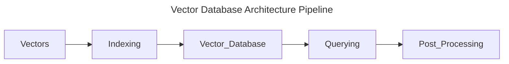

# [[Database Systems Data Models Vector]] Architecture

- [[Database Systems Data Models]]
- [[Database Systems Data Models Vector]]

A Vector Database uses a combination of different algorithms that all participate in Approximation Nearest Neighbor (ANN) search. These algorithms optimize the search through hashing, quantization, or graph-based search. These algorithms are assembled into a pipeline that provides fast and accurate retrieval of the neighbors of a queried vector.

Since the vector database provides approximate results, the main trade-offs we consider are between accuracy and speed. The more accurate the result, the slower the query will be. However, a good system can provide ultra-fast search with near-perfect accuracy.

## Overview

- Database Systems Data Models Vector Architecture Algorithms: The common goal of Database Systems Architecture is to enable fast querying by creating a data structure that can be traversed quickly.
    - They will commonly transform the representation of the original vector into a compressed form to optimize the query process.
    - Vector Databases is designed to handle all the complexities and algorithmic decisions behind the scenes, ensuring us get the best performance and results without any hassle.

## Database Systems Data Models Vector Architecture Pipeline

- Vector Database Indexing: The Vector Database indexes vectors using an ANN algorithm (PQ, LSH, or HNSW).
    - The step maps the vectors to a data structure that will enable faster searching.
- Vector Database Querying: The Vector Database compares indexed query vector to the indexed vectors in the database to find the nearest neighbors by applying a similarity metric used by that index.
- Vector Database Post Processing: In some cases, the vector database retrieves the final nearest neighbors from the dataset and post-processes them to return the final results.
    - The step can include re-ranking the nearest neighbors using a different similarity measure.

## Database Systems Data Models Vector Architecture Algorithms

- Database Systems Data Model Vector Architecture Algorithms Random Projection: The basic idea behind random projection is to project the high-dimensional vectors to a lower-dimensional space using a random projection matrix. [[Algebra Linear Matrices Symmetric]]
    - We create a matrix of random numbers. The size of matrix is the target low-dimension values we want.
    - We then calculate the convolution (dot product with respect to each column of the matrix and the input vectors), which results in a projected matrix that has fewer dimensions then our original vectors but still preserves their similarity.
    - When we query, we use the same projection matrix (convolution) to query vector onto the lower-dimensional space.
        - Then, we compare the projected query vector to the projected vectors in the database to find the nearest neighbors.
    - Since, the dimensionality of the data is reduced, the search process is significantly faster than searching the entire high-dimensional space.
    - Random Projection Remark: The random projection is an approximation method, and the projection quality depends on the properties of the projection matrix.
        - In general, the more random the projection matrix is, the better the quality of the projection will be.
        - But generating a truly random projection matrix can be computationally expensive, especially for large datasets.
- Database Systems Data Model Vector Architecture Algorithm Product Quantization: The Product Quantization (PQ) is a lossy compression technique for high-dimensional vectors to build an index.
    - It takes the original vector, breaks it up into smaller chunks, simplifies the representation of each chunk by creating a representative code for each chunk.
    - And then it puts all the chunks back together. The whole process manipulate the vector without losing information which is vital for similarity operations.
    - Product Quantization Splitting: The Vectors are broken into segments (chunks).
    - Product Quantization Training: We will build a codebook for each segment.
        - Simply maintain a pool of potential codes generated by this algorithm that could be assigned to a vector.
        - In practice, the codebook is made up of the center points of clusters created by performing $k-$means clustering on each of the vector segments.
            - We would have the same number of values in the segment codebook as the value we use for $k-$means clustering.
    - Product Quantization Encoding: The Product Quantization Assigns a specific Code to each segment in the codebook.
        - In practice, we find the nearest value in the codebook to each vector segment after the training is complete.
        - Our PQ code for the segment will be the identifier for the corresponding value in the codebook.
            - We could use as many as PQ codes as we would like, including multiple values from the codebook to represent each segment.
    - Product Quantization Querying: When we query, the algorithm breaks down the vectors into sub-vectors and quantizes them using the same codebook.
        - Then, it uses the indexed codes to find the nearest vectors to query vector.
    - Product Quantization Remark: The number of representative vectors in the codebook is a trade-off between the accuracy of the representation and computational cost of searching the codebook.
        - The more representative vectors in the codebook, the more accurate the representation of the vectors in the subspace, but the higher the computational cost to search the book.
        - By contrast, the fewer representative vectors in the codebook, the less accurate the representation, but the lower the computational cost.
- Database Systems Data Model Vector Architecture Algorithm Locality-Sensitive Hashing: The Locality-Sensitive Hashing (LSH) is a technique for indexing in the context of an approximate nearest-neighbor search.
    - The LSH is optimized for speed while still delivering an approximate, non-exhaustive result.
    - The LSH maps similar vectors into buckets using a set of hashing functions.
    - LSH Querying Process: To find the nearest neighbors for a given query vector, we use the same hashing functions used to bucket similar vectors into hash tables.
        - The query vector is hashed to a particular table and then compared with the other vectors in the same table to find the closest matches.
    - LSH Remark: The LSH method is much faster than searching through the entire dataset because there are far fewer vectors in each hash table than in the whole space.
        - It is important to remember that LSH is an approximate method, and the quality of the approximation depends on the properties of the hash functions.
        - In general, the more hash functions used, the better the approximation quality will be.
        - However, using a large number of hash functions can be computationally expensive and may not feasible for large datasets.
- Database Systems Data Model Vector Architecture Algorithm Hierarchical Navigable Small World (HNSW): The Hierarchical Navigable Small World creates a hierarchical, tree-like structure where each node of the tree represents a set of vectors.
    - The edges between the nodes represent the similarity between the vectors.
    - HNSW Node Construction: The HNSW starts by creating a set of nodes, each with a small number of vectors. (Clustering the vectors with algorithms like K-Means, where each cluster becomes a node.)
    - HNSW Tree Construction: The HNSW then examines the vectors of each node and draws an edge between that node and the nodes that have the most similar vectors to the one it has.
    - HNSW Querying Process: When we query an HNSW index, it uses this graph (tree) to navigate through the tree, visiting the nodes that are most likely to contain the closest vectors to the query vector.

## Database Systems Data Model Vector Architecture Similarity Measures

- Database Systems Data Model Vector Architecture Similarity Measures Meaning: The Similarity Measures are the foundation of how a vector database compares and identifies the most relevant results for a given query.
- Database Systems Data Model Vector Architecture Similarity Measures Description: Similarity Measures are mathematical methods for determining how similar two vectors are in a vector space.
    - Similarity measures are used in vector database to compare the vectors stored in the database and find the one that are most similar to a given query vector.
- Database Systems Data Model Vector Architecture Similarity Measures Cosine ($\cos{\theta} = \frac{\boldsymbol{u}^{\mathrm{T}}\boldsymbol{v}}{\left\lVert \boldsymbol{u}\right\rVert\left\lVert \boldsymbol{v}\right\rVert}$): The Cosine Similarity measures the cosine of the angle between two vectors in a vector space.
    - The Cosine Similarity ranges from $[-1, 1]$, where $1$ represents identical vectors, $0$ represents orthogonal vectors, and $-1$ represents vectors that are dimetrically opposed.
- Database Systems Data Model Vector Architecture Similarity Measures Euclidean Distance ($\left\lVert \boldsymbol{u} - \boldsymbol{v}\right\rVert = (\boldsymbol{u} - \boldsymbol{v})^{\mathrm{T}}(\boldsymbol{u} -\boldsymbol{v})$): The Euclidean Distance measures the straight-line distance between two vectors in a vector space.
    - The Euclidean Distance ranges from $0$ to infinity, where $0$ represents identical vectors, and large values represents increasing dissimilar vectors.
- Database Systems Data Model Vector Architecture Similarity Measures Dot Product ($\boldsymbol{u}^{\mathrm{T}}\boldsymbol{v}$): The Dot Product measures the inner product of them in the linear normed space $\mathbb{R}^{n}$.
    - The Dot Product ranges form $(-\infty, \infty)$, where a positive value represents that point in the same direction, $0$ represents orthogonal vectors, and a negative value represents vectors that point in opposite directions.
- Database Systems Data Model Vector Architecture Similarity Measures Remark: The choice of similarity measure will have an effect on the results obtained from a database.
    - It is important to choose the right one depending on the use case and requirements.

# Footnotes
