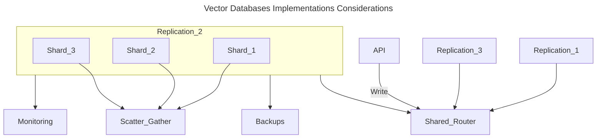

# [[Database Systems Data Models Vector]] Implementations

- [[Database Systems Data Models]]
- [[Database Systems Data Models Vector]]

Vector Databases are equipped with a set of capabilities that makes them better qualified to be used in high scale production settings.

## Overview

## Database Systems Data Models Vector Implementations Considerations

## Database Systems Data Models Vector Implementations Performance and Fault Tolerance

- Database Systems Data Models Vector Implementations Performance and Fault Tolerance Prelude: Performance and Fault Tolerance are tightly related.
    - The more data we have, the more nodes that are required, and the bigger chance for errors and failures.
    - As is the case of other databases, we need to ensure that queries are executed as quickly as possible even if some of the underlying nodes fail. (Hardware Failures, Network Failures, or Other Types of Technical Bugs)
    - To ensure both high Performance and Fault Tolerance, Vector Databases use Sharding and Replication.
- Database Systems Data Model Vector Implementations Performance and Fault Tolerance Sharding: Vector Database Sharding refers partitioning the data across multiple nodes.
    - There are different methods for partitioning the data.
        - It can be partitioned by the Similarity of different clusters of data so that similar vectors are stored in the same partition.
    - When a query is made, it is sent to all the shards and the results are retrieved and combined. (Scatter-Gather Pattern)
- Database Systems Data Model Vector Implementations Performance and Fault Tolerance Replication: Vector Database Replication refers creating multiple copies of the data across different nodes.
    - This ensures that even if a particular node fails, other nodes will be able to replace it.
    - There are two main consistency models: Eventual Consistency and Strong Consistency.
        - Eventual Consistency: Eventual Consistency allows for temporary inconsistencies between different copies of the data which will improve the availability and reduce latency but may result in conflicts and even data loss.
        - Strong Consistency: Strong Consistency requires that all copies of data are updated before a write operation is considered complete.
            - The approach provides stronger consistency but may result in higher latency.

## Database Systems Data Models Vector Implementations Monitoring

- Database Systems Data Models Vector Implementations Monitoring Prelude: To effectively manage and maintain a vector database, we need a robust monitoring system that tracks the important aspects of the database performance, health, and overall status.
    - Monitoring is critical for detecting potential problems, optimizing performance, and ensuring smooth production operations.
- Database Systems Data Model Vector Implementations Monitoring Resource Usage: We can monitor the resource usage such as CPU, memory, disk space, and network activity of vector databases.
    - Resource Usage information enables the identification of potential issues or resource constraints that could affect the performance of the database.
- Database Systems Data Model Vector Implementations Query Performance: Vector Databases allows us to monitor the query latency, throughput, and error rates which may indicates potential systemic issues.
- Database Systems Data Model Vector Implementations System Health: Vector Databases display overall systems health includes the status of individual nodes, the replication process, and other critical components.

## Database Systems Data Models Vector Implementations Access Control

- Database Systems Data Models Vector Implementations Access Control Prelude: Vector Database Control is the process of managing and regulating user access to data and resources.
    - Access Control is a vital component of data security, ensuring that only authorized users have the ability to view, modify, or interact with sensitive data stored within the vector database.
- Database Systems Data Models Vector Implementations Access Control Data Protection: As AI applications often deal with sensitive and confidential information, implementing strict access control mechanisms helps safeguard data from unauthorized access and potential breaches.
- Database Systems Data Models Vector Implementations Access Control Regulation Compliance: Many industries (health-case and finance) are subject to strict data Privacy regulation. Implementing proper access control helps organization comply with Privacy regulations, protecting them from legal and financial repercussions.
- Database Systems Data Models Vector Implementations Access Control Accountability and Auditing: Access control mechanisms enable organizations to maintain a record of user activities within the database.
    - These user activities information is crucial for auditing purposes, and when security breaches happens, it helps traces back any unauthorized access or modification.
- Database Systems Data Models Vector Implementations Access Control Scalability and Flexibility: As organizations grow and evolve, their access control may change.
    - A robust access control system allows for seamless modification and expansion of user permissions, ensuring that data security remains intact throughout the organization growth.

## Database Systems Data Models Vector Implementations Backups

- Database Systems Data Models Vector Implementations Backups Prelude: When all else fails, vector database offer the ability to rely on regularly created backups.
- Database Systems Data Models Vector Implementations Backups: Vector Databases regular backups can be stored on external storage systems or cloud-based storage services, ensuring the safety and recoverability of the data.
- Database Systems Data Models Vector Implementations Backups Remark: In case of data loss or corruption, these backups can be used to restore the database to a previous state, minimizing downtime and impact on the overall system.

## Database Systems Data Models Vector Implementations API

- Database Systems Data Models Vector Implementations API: By providing a user-friendly interface, the vector database API layer simplifies the development of high-performance vector search applications.
- Database Systems Data Models Vector Implementations API SDKs: In addition to the APIs, vector databases should provide programming language specific SDKs that warp the API.
    - These SDKs make it even easier for developers to interact with the database in their applications.
    - This allows developers to concentrate on their specific use cases, such as semantic text search, generative question-answering, hybrid search, image similarity search, or product recommendations, without having to worry about the underlying infrastructure complexities.

## Database Systems Data Models Vector Implementations World

- Pinecone
- Qdrant

# Footnotes
