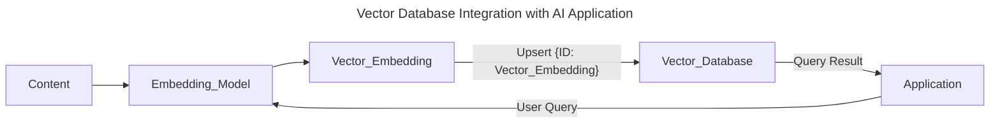

# [[Database Systems Data Models]] Vector

- [[Database Systems]]
- [[Database Systems Data Models]]

A vector database is a type of database that stores data as high-dimensional vectors, which are mathematical representations of features or attributes. Each vector has a certain number of dimensions, which can range from tens to thousands, depending on the complexity and granularity of the data.

The vectors are usually generated by applying some kind of transformation or embedding function to the raw data, such as text, images, audio, video, and others. The embedding function can be based on various methods, such as machine learning models, word embeddings, feature extraction algorithms.

## Overview

- Database Systems Data Models Vector Database: Vector Databases have the capabilities of a traditional database that are absent in standalone vector indexes and the specialization of dealing with vector embedding, which traditional scalar-based database lack.
- Database Systems Data Models Vector Features: The main advantage of a vector database is that it allows for fast and accurate similarity search and retrieval of data based on their vector distance or similarity.
    - This means that instead of using traditional methods of querying databases based on exact matches or predefined criteria, we can use a vector database to find the most similar or relevant data based on their semantic or contextual meaning. 
- Database Systems Data Models Vector Intensions: Vector Databases are intentionally designed to handle the Vector Embeddings and offer the performance, scalability, and flexibility we need to make the most out of our data.
- Database Systems Data Models Vector Improvements: Vector Databases provides a superior solution for handling vector embedding by addressing the limitations of standalone vector indices, such as scalability challenges, cumbersome integration processes, the absences of real-time updates and builtin security measures, ensuring a more effective and streamlined data management experience.

## Database Systems Data Models Vector Integration

- Vector Embedding Transformation: We use the Embedding Model to create Vector Embeddings for the Content we want to index.
- Vector Embedding Upsert (`upsert`): We insert the Vector Embedding with some reference to the original content the embedding was created from into the Vector Database.
- Application Query: When the application issues a Query, we use the same embedding model to create Embedding for the query.
- Vector Database Query: We then use those embedding to query the database for similar vector embeddings.
    - Then we can use the similar vector embeddings to fetch the original content that was used to create them.

## Database Systems Data Models Vector Improvements

- Database Systems Data Models Vector Improvements: Prior to the existence of Vector Databases, the standalone Vector Indices like FAISS (Facebook AI Similarity Search) can significantly improve the search and retrieval of Vector Embeddings, but they lack capabilities that exist in any database.
    - Vector Databases are purpose-built to manage vector embeddings, providing several advantages over using standalone vector indices.
- Database Systems Data Models Vector Data Management: Vector Databases offer well-known and easy-to-use features for data storage, like inserting, deleting, and updating data.
    - This makes managing and maintaining vector data easier than using standalone vector index.
- Database Systems Data Models Vector Metadata Storage and Filtering: Vector Databases can store metadata (Payload) associated with each vector entry.
    - Users can then query the database using additional metadata filter for finer-grained queries.
- Database Systems Data Models Vector Scalability: Vector Databases are designed to scale with growing data volumes and user demand, providing better support for distributed and parallel processing.
    - Standalone vector indices may require custom solutions to achieve similar level of scalability (such as deploying and managing them on Kubernetes clusters).
- Database Systems Data Models Vector Real-Time Updates: Vector Databases often support real-time data updates, allowing for dynamic changes to the data.
    - Whereas, standalone vector indexes may require a full reindexing process to incorporate new data, which can be time-consuming and computationally expensive.
- Database Systems Data Models Vector Backups and Collections: Vector Databases handles the routine operations of backing up all the data stored in the database.
- Database Systems Data Models Ecosystem Integrations: Vector Databases can more easily integrate with other components of a data processing ecosystem.
    - ETL Pipeline (Spark), Analytics Tools (Tableau and Segment), And Visualization Platforms (Grafana).
    - It also enables easy integration with other AI related tools like LangChain, LlamaIndex and ChatGPT.
- Database Systems Data Models Security and Access Control: Vector Database Typically offer builtin data security features and access control Mechanisms to protect sensitive information.

## [[Database Systems Data Models Vector Architecture]]

## [[Database Systems Data Models Vector Embeddings]]

## [[Database Systems Data Models Vector Query]]

## [[Database Systems Data Models Vector Implementations]]

## [[Database Systems Data Models Vector Applications]]

# Footnotes
